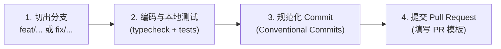

# 贡献与提交规范

> 感谢参与 Mio 的建设！为了保持代码库的可靠性与历史清晰度，请遵循本规范参与贡献。

---

## ⚡ 极简贡献流程（3 步上手）



---

## 📝 提交信息规范（Conventional Commits）

所有提交均须遵循标准格式：

```text
<type>(<scope>): <简洁清晰的动宾描述>

[可选详细正文：说明变更原因、最终行为与设计考量]

[可选破坏性变更：BREAKING CHANGE: 描述不兼容变更与迁移方案]
```

### 1. 提交类型（Type）字典

| Type | 适用场景 | 范例 |
|---|---|---|
| **`feat`** | 新增用户或系统可见的功能 | `feat(memory): 支持群成员主动纠正偏好记忆` |
| **`fix`** | 修复已知的错误行为或漏洞 | `fix(outbox): 网络超时时保持 uncertain 状态避免重复发送` |
| **`docs`** | 仅修改文档、注释或说明文件 | `docs: 优化架构与限制说明文档` |
| **`refactor`**| 重构代码，既不修复错误也不添加功能 | `refactor(worker): 提取车道调度队列管理逻辑` |
| **`test`** | 添加缺失的测试或重构现有测试 | `test(plugins): 补充原型污染攻击阻断用例` |
| **`perf`** | 提升系统吞吐或降低响应延迟 | `perf(store): 为消息表增加车道检索联合索引` |
| **`build`** | 依赖包、构建流程或 Docker 配置变更 | `build(docker): 锁定 Bun 基础镜像版本` |
| **`ci`** | GitHub Actions 等持续集成工作流修改 | `ci: 添加 node 与 bun 双重测试检查流水线` |
| **`chore`** | 琐碎杂项、依赖元数据更新或代码规范微调 | `chore(repo): 统一项目命名与贡献规则` |
| **`revert`**| 撤销之前的特定提交 | `revert: 撤销对消息超时时间的调整` |

### 2. 优秀范例对比（Contrast）

| ✅ 推荐提交信息 | ❌ 不合格提交信息 | 不合格原因 |
|---|---|---|
| `feat(plugin): 增加响应流最大 256KiB 熔断保护` | `update code` | 含义模糊，缺乏上下文 |
| `fix(policy): 过滤消息中的全员提醒语法` | `fix bug` | 未说明修复了什么 Bug |
| `docs(ops): 完善数据完整删除操作指南` | `docs` | 缺乏具体的修改范围说明 |

---

## 🔍 本地自检指令矩阵

在提交代码前，请在本地完整运行以下检查：

| 检查目标 | 终端命令 | 必需场景 | 验收标准 |
|---|---|---|---|
| **提交格式钩子** | `npm run hooks:install` | 首次拉取仓库时（可选） | 自动在 commit 时校验标题格式 |
| **类型检查** | `npm run typecheck` | 所有代码改动 | **0 errors**，无隐式 `any` |
| **Node 核心单测** | `npm run test:node` | 涉及存储、队列、策略的改动 | **12/12 passed**，测试覆盖预期场景 |
| **Bun 原生单测** | `bun test` | 正式发布或合并前 | **12/12 passed**，与生产环境运行时一致 |
| **Git 格式检查** | `git diff --check` | 所有改动（含文档） | 无多余空白字符或合并冲突标记 |

> [!TIP]
> **文档类修改免测**：如果本次仅修改了 Markdown 文档，只需执行 `git diff --check` 检查排版与死链即可，无需机械等待全量测试执行。

---

## 🛡️ 核心贡献守则与红线

1. **坚持最小改动原则**：
   - 保持小而专注的 Commit，不将格式美化与业务逻辑混在一个提交中；
   - 严禁对未经授权的已有代码进行大面积“风格重构”。
2. **严禁破坏持久化兼容性**：
   - 存储持久化键（如 `forgotten:...`、`growth-day:...`）与 `/companion` 指令名称是已经落盘和用户习惯的接口，**严禁仅为品牌命名修改已落盘的 Key 名称**。
3. **安全与隐私保密原则**：
   - 严禁将真实 `.env` 凭据、私钥、测试工作区的真实聊天内容提交至代码仓库；测试用例一律使用合成数据与 Mock 客户端。
4. **命名一致性标准**：
   - GitHub 仓库名统一为 **Mio**；
   - npm 包名统一为 **mio**；
   - 产品显示中文名统一为 **澪**。
