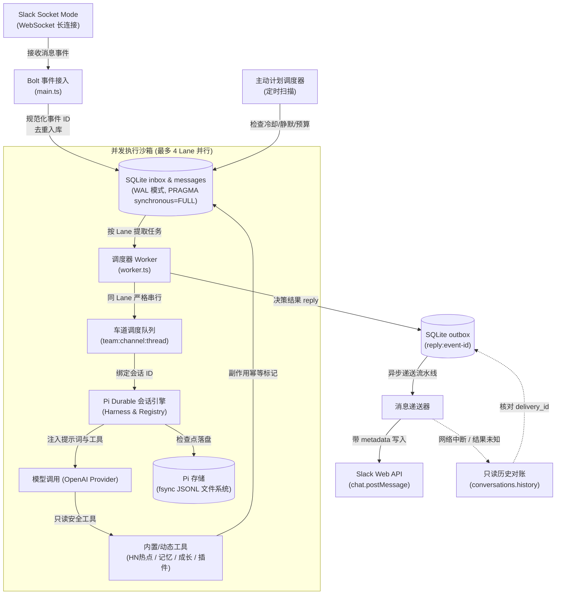
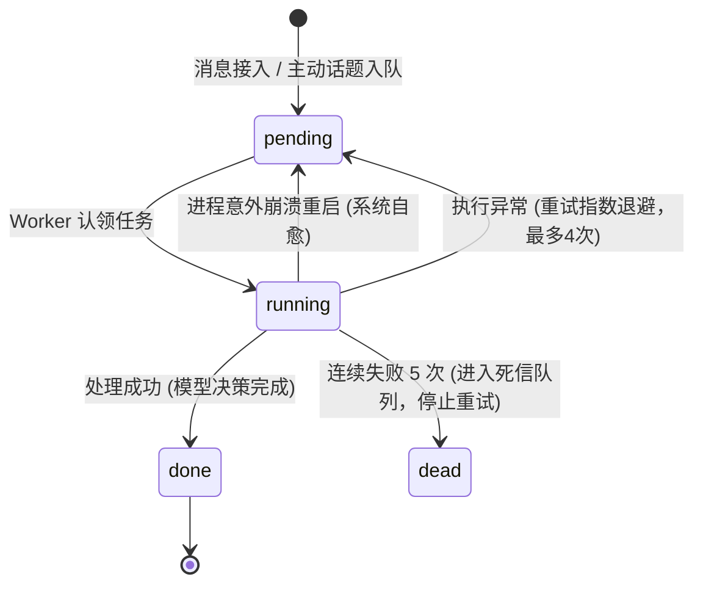
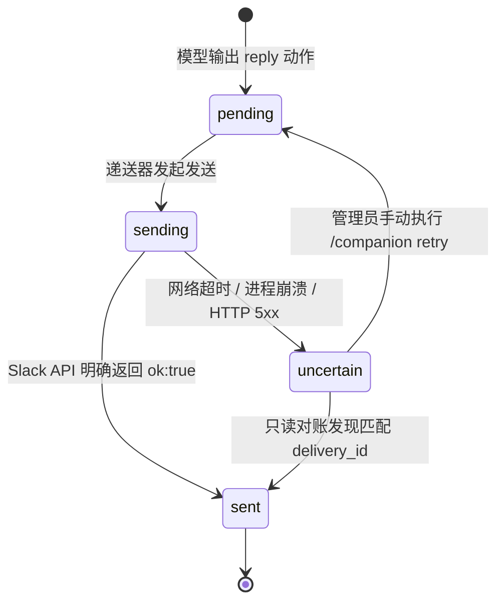

# 架构与恢复语义

> 本文档规范 Mio 的系统组件架构、双存储模型、车道调度并发机制、Outbox 递送对账与崩溃自愈语义。

---

## 🏗️ 整体架构流程

系统分为**事件接入**、**车道调度与会话管理**、**模型思考与工具执行**、**可靠递送与对账**四大核心环节：

---

## 💾 存储模型：双存储与无全局原子事务

系统采用 **SQLite** 与 **Pi JSONL** 协同存储，各自职责泾渭分明：

| 存储介质 | 存储内容 | 写入保证 | 恢复机制 |
|---|---|---|---|
| **SQLite (`companion.sqlite`)** | 事件收件箱 (`inbox`)、发件箱 (`outbox`)、原始消息窗口、成员记忆、成长审计日志、插件配方、KV状态 | WAL 模式，`PRAGMA synchronous=FULL`，本地 ACID 事务 | 重启时重置 running 状态；WAL 自动恢复 |
| **Pi JSONL (`data/pi/`)** | 模型对话长期转录、任务执行检查点、工具调用参数与结果缓存 | 追加写入（Append-only），每次提交均执行 `fsync` 刷盘 | 启动时通过 `Harness.resume()` 重放未竟任务 |

> [!IMPORTANT]
> **无分布式双写事务**：
> SQLite 事务与 Pi JSONL 提交分属两个存储，**不存在跨数据库的分布式原子事务**。
> - **容错设计**：若在 Pi 会话创建完成与 SQLite 映射保存之间进程崩溃，可能产生一个未被引用的孤立 Pi 会话，但**绝不会导致向同一个 Lane 重复发送两条回复**。
> - **副作用幂等性**：模型工具（如 `remember_member`、`grow`、`create_plugin`）均使用 Pi 提供的 `taskId` 作为唯一幂等键记录在 SQLite 中，重放时跳过已执行的副作用。

---

## 🚦 车道（Lane）调度与并发控制

为了保证群聊对话的自然感，系统采用按会话粒度细分的 **Lane 调度模型**。

### 1. Lane 的定义规则
Lane 标识格式为：`team_id:channel_id:(thread_ts | "main")`
- **主时间线发言**：独立为一个 Lane（`...:main`）。
- **每个不同线程（Thread）**：各自拥有独立的 Lane。

### 2. 调度与并发守则
- **同 Lane 严格串行（FIFO）**：同一 Lane 内的消息必须严格按接收顺序依次处理。前序任务如果发生异常进入指数退避等待，**后续任务严禁超车**，必须等待前序任务处理完毕或超时终结。
- **跨 Lane 完全并行**：不同频道或不同线程之间的任务互不阻塞，最多允许 `MAX_CONCURRENT_LANES`（默认 4 个）并发调用大模型。

---

## 🔄 任务状态机与故障自愈

### 1. 收件箱状态机 (`inbox`)

- **确定性请求复用**：向 Pi 提交请求时使用确定性 `requestId = "event:<id>"`。若在提交后崩溃重试，Pi 会复用已提交的结果，而不会导致二次扣费或重复生成。
- **死信保护**：单条消息连续失败 5 次后标记为 `dead`，避免损坏的报文或无法解析的模型响应导致整个 Lane 永久卡死。

### 2. 发件箱状态机 (`outbox`)

发件箱的主键为 `reply:<event-id>`，在消息写入 outbox 后才将 inbox 标记为 `done`。

---

## ⚠️ Slack 递送与非 Exactly-Once 现实

> [!WARNING]
> **本系统不宣称且不支持 Slack Exactly-Once（严格一次）交付。**
> 任何将消息递送至第三方即时通讯平台（Slack）的系统，在网络分区和崩溃边界上都无法实现真正的分布式 Exactly-Once。

### 1. 为什么会出现 `uncertain`（结果不确定）？
当系统调用 Slack `chat.postMessage` 时，可能出现 Slack 服务端已成功入库并向群内广播消息，但此时由于本地断网或进程被强杀，客户端未收到 HTTP 响应。此时如果盲目重试，群内必然出现“重复发两条”的糟糕体验。

### 2. 只读对账机制（Reconciliation）
当状态变为 `uncertain` 时，系统在后续轮询中执行**只读核对**：
1. 请求 `conversations.history` 或 `conversations.replies` 获取最近 100 条消息；
2. 检查消息的 `metadata.event_payload.delivery_id` 是否等于当前的 `outbox.id`；
3. **核对成功**：更新状态为 `sent`，记录真实 `ts`；
4. **未查到记录**：**未查到绝不等于没有发送！**（Slack API 分页截断、Bot 权限受限或读写延迟均可能导致读不到）。因此系统**绝对不会自动重发**，保持 `uncertain` 并等待管理员人工核实。

> [!TIP]
> **自动重试已关闭**：Slack Bolt SDK 的内部自动重试已被显式关闭（`retries: 0`），杜绝隐藏的写重试引发消息连发。

---

## 🔒 单进程独占锁与部署约束

### 1. 互斥锁机制（`owner.lock`）
为了防止多个服务实例同时读写同一个 SQLite 数据库与 Pi JSONL 文件造成存储损坏，程序启动时执行原子创建独占锁文件：
- 文件位于 `DATA_DIR/owner.lock`，内容为当前进程 PID。
- **陈旧锁自愈**：如果检测到锁文件已存在，但通过 `process.kill(pid, 0)` 确认该 PID 已经在宿主机上彻底终止（`ESRCH`），程序会自动安全清理陈旧锁并接管；
- **存活冲突拒绝**：如果进程仍存活，启动立即失败并抛出异常。

### 2. 部署硬性红线
- **绝对禁止多实例水平扩容**：针对同一个数据目录，只能且必须运行一个容器或进程。
- **禁止网络共享卷**：`owner.lock` 无法检测跨物理机或容器隔离命名空间之间的 PID 冲突。不要在 NFS / SMB / 共享卷上多开实例。

---

## 📊 架构限制与设计边界汇总

| 限制维度 | 现状与硬指标 | 设计考量与应对 |
|---|---|---|
| **递送语义** | At-least-once 产生写入意图，At-most-once 自动化发送（未确认不盲发） | 优先保证群聊不被同一句话刷屏；异常交由管理员审查 |
| **对账深度** | 每次只读核验最近 **100 条** 历史记录 | 避免全量拉取历史引发 Slack Rate Limit；超出范围人工核实 |
| **死信处理** | 重试 5 次失败后标记为 `dead`，系统**不自动清理**死信 | 保留故障现场便于排查；由管理员定期使用 SQL 归档清理 |
| **高可用与容灾** | 无多节点 Leader Election；依靠 Docker / Supervisor 崩溃自重启 | 极简架构，单节点快速故障恢复，避免分布式一致性复杂性 |
| **数据自愈边界** | 仅覆盖：进程崩溃恢复、网络临时重试、未完成事务回滚 | **不可自愈**：磁盘坏道、存储满、SQLite 物理损坏、代码逻辑 Bug |
