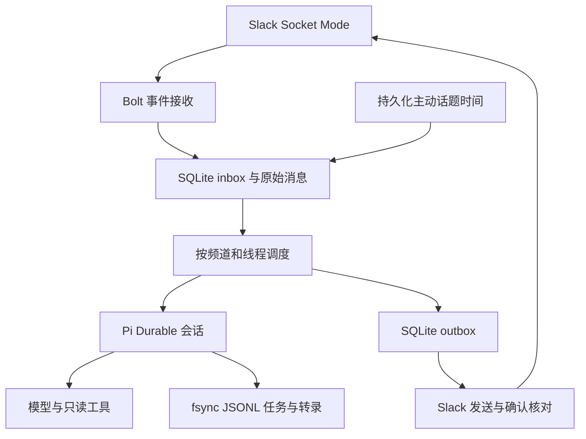

# 架构与恢复语义

## 组件

生产运行时为 Bun。应用数据库使用 bun:sqlite；Node 24 兼容适配器只为受限环境验证提供相同 query/transaction 接口。Pi 使用官方 openNodeJsonlStorage，通过 Bun 的 Node 文件系统兼容层运行，不提供 read/write/bash 等宿主执行工具。

Pi Durable、pi-ai、Chord 当前安装版本为 1.1.0，Slack Bolt 为 5.1.0。依赖已锁定；实际接口以 node_modules 的类型声明和 README 为依据。Pi 的 conversation ID 是 branded number，保存到应用 KV 时保留数字类型。

## 事件与队列

`slack:<team>:<channel>:<ts>` 是规范化事件 ID。普通 message 和 app_mention 重复通知进入同一主键，因此只入队一次。频道/线程 lane 为 `<team>:<channel>:<thread_ts|main>`。同 lane 内按接收顺序执行，前一任务在退避时仍阻止后续任务超车；不同 lane 可同时调用模型。

收到事件后同步提交 SQLite，再返回 listener。Socket Mode 的传输确认由 SDK 管理：SDK 确认与 SQLite 入库不是分布式原子事务。存在极短的进程崩溃窗口，事件可能未入库，也不保证 Slack 一定重送。当前版本没有历史补偿扫描，上线前需要在实际工作区做故障注入。

`inbox` 状态为 pending → running → done，失败进入指数退避，5 次后 dead。重启把 running 恢复为 pending。重试 Pi 使用同一 requestId `event:<id>`，已有提交复用而非重复请求。若同一次模型回答是永久无效 JSON，重复 requestId 会复用无效回答，最终 dead；操作员应修正配置并重新建立事件，不无休止重试。

## 会话与记忆

每 lane 保存一个 Pi conversation ID。不同 lane 互不等待。线程首次输入附带本频道主时间线与该线程的近期原始消息，排除其他线程、其他频道和事件之后的消息。Pi 后续维护自己的长期会话，过长时使用其默认自动压缩策略。不是完整频道历史同步。

应用层 KV 保存人设、暂停状态、主动计划、会话映射和幂等工具记录；members 保存每频道成员记忆；growth 保存变更理由与事件依据；plugins 保存动态配方。会话映射创建和 Pi 创建跨两个存储，不是一个事务：创建后映射前崩溃可能产生一个未使用的孤立会话，但不会导致同一 lane 发送两条回复。

模型工具使用 Pi taskId 作为应用副作用幂等键。remember 与成长在 SQLite 同一事务里标记；插件相同配方重复提交不增加版本。插件保存后由 registry 加载，重启从 SQLite 重载。增长、关系与 Pi 转录跨存储提交存在间隙，工具重放通过幂等键补齐；不能声称两个数据库有全局原子性。

## 对外发送

outbox ID 为 `reply:<event-id>`。模型回答写入 outbox 后再标记 inbox done；如果两步之间崩溃，重放发现同一 outbox，不会新建第二条。

pending → sending → sent。在网络失败或进程崩溃导致发送结果未知时，状态变为 uncertain。核对 conversations.history/replies 中的 companion_delivery metadata，发现匹配 ID 才标记 sent。没有匹配不能证明消息没发送，因此不会自动重新发送。管理员可以人工核对后 retry。

**不宣称 Slack exactly-once delivery**。读写分离、分页、metadata 权限和 Slack API 限制都会影响核对结果；本版每次只读取最近最多 100 条，不自动遍历完整历史。尤其 bot token 对 conversations.replies 的访问限制需要实测，线程 uncertain 可能只能人工核对。Slack SDK 的自动 retry 已关闭，防止隐藏的写重试。

## 重启与部署

Pi resume 恢复未完成模型/工具任务。SQLite 恢复应用 running 队列与发送未知状态。owner.lock 防止本机两个进程打开同一数据目录，陈旧 PID 文件可以自动回收；不能用于跨主机共享卷，也不能证明容器 PID 命名空间之间的所有权。部署必须单副本、独占目录。Docker restart 策略负责进程恢复，依赖宿主与数据卷正常。

当前没有多副本 leader election、自动数据库损坏修复、可靠性监控后台或自动成本熔断。新增这些能力时，先明确故障模型，再测试真正的杀进程与恢复流程。
