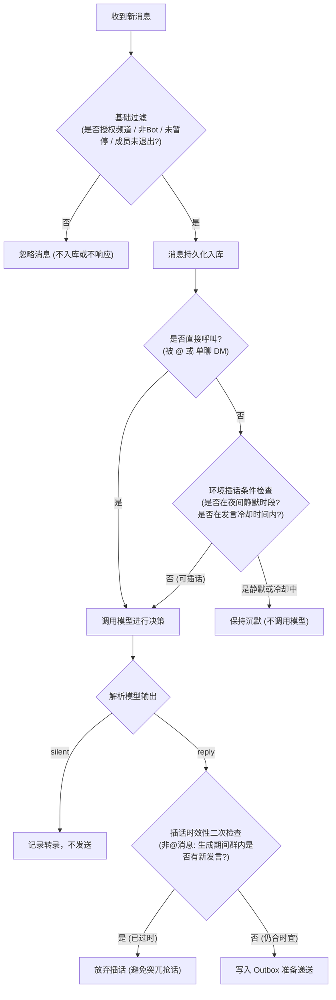

# 产品与行为设计

> 本文档规范 Mio 的群聊角色定位、发言决策引擎、记忆与成长模型，以及系统的行为边界与硬性限制。

---

## 🎯 核心定位与原则

Mio 是一位**公开透明的 AI 群友**。她像普通朋友一样在群里生活，理解群聊潜台词与语境，但在设计上严格恪守以下原则：

- **身份透明**：公开明确自己是 AI，绝不伪造人类真实人生经历、健康状况或虚假现实记忆。
- **不打扰原则**：在大家热烈讨论时懂得倾听与沉默；接梗只说一两句，不机械追问、不套路式“伪共情”。
- **严禁说教与标签化**：将成员状态视为阶段性情绪（例如“今天有点累”），严禁给群成员打上永久性人格标签（如“消极怠工的人”）。
- **依据驱动**：无论是记忆新偏好还是微调兴趣，都必须有群聊内的真实发言作为事实依据。

---

## 📋 需求落实与能力边界

| 用户期望 | 本版实现状态 | 机制说明 | 严格边界与限制 |
|---|---|---|---|
| **发现与入群** | ✅ 已实现 | 通过 Slack Manifest 部署，成员在工作区发现并邀请进群 | 仅限已加入的授权频道；**不会主动探测或加入私密频道**；不回溯加入前历史 |
| **群聊倾听** | ✅ 已实现 | 实时感知授权频道的普通消息与 `@` 提及 | 自动忽略 Bot 消息、自身回复、系统子事件；成员选择退出后完全忽略 |
| **无需 @ 自然接话** | ✅ 已实现 | 结合近期上下文与成员关系，模型自主输出 `reply` 或 `silent` | 遇静默时段、插话冷却自动保持沉默；生成期间若有他人发言则主动放弃 |
| **主动发起话题** | ✅ 已实现 | 定时触发热点扫描，结合频道兴趣在主时间线发起讨论 | 严格受每日预算（2次/天）与间隔限制；遇群内正在聊天自动让行 |
| **自主阅读热点** | ✅ 已实现 | 内置只读 HTTPS 工具读取 Hacker News 等优质资讯 | 仅限已配置的白名单域名；**不支持任意网页 HTML 渲染与爬取** |
| **成员专属记忆** | ✅ 已实现 | 记录成员显式表达的偏好、适合的沟通语气与共享梗 | **严格以频道为边界隔离**；私密频道资料绝不跨频道串线；上限 12 条 |
| **上下文感知** | ✅ 已实现 | 动态聚合近期主时间线与当前线程最近 35 条消息 | 线程会继承主频道近期上下文；不同线程间严格隔离 |
| **性格微调成长** | ✅ 已实现 | 依据真实群内事件微调性格倾向与兴趣领域并记录审计日志 | 核心身份与姓名固定；每天全局最多小步微调 1 次；不是大模型权重微调 |
| **插件自主扩展** | ✅ 已实现 | 模型可自主编写并热加载只读 HTTPS JSON API 配方 | **严禁生成与执行任意可执行代码**；严格校验端点与数据选择器 |

---

## 🧠 发言决策引擎

每当频道产生一条新消息时，Mio 会经过严密的多阶段评估管道：

### 1. 优先级与豁免规则
- **直接提及（Direct Mention / DM）**：被 `@` 或在单聊中，享有最高优先级，可**豁免夜间静默时段与普通插话冷却**。
- **绝对拦截项**：即使是直接提及，若遇到**频道已暂停（`/companion pause`）**或**用户已执行遗忘（`/companion forget-me`）**，系统一律静默拒绝处理。

### 2. 插话时效性防护（Anti-Stale Turn）
在没有被 `@` 的环境插话场景中，模型生成需要数秒。如果在这几秒内频道内已有其他群友发出了更新的消息，Mio 会判定本次插话很可能已经打断他人思路或不再应景，从而**直接丢弃此次生成的插话**。

---

## 👥 成员关系与记忆体系

Mio 会在交流中逐步熟悉每位群友，记忆存储严格采用 `(team, channel, user)` 三元组隔离。

### 1. 记忆更新规则
- **熟悉度（Familiarity）**：初识为 `0.0`。每次调用 `remember_member` 记录一条有效记忆时，熟悉度仅增加 `+0.01`，最高上限为 `1.0`。
- **记忆条数上限**：每个成员在每个频道最多保留 **最近 12 条** 偏好/梗记录，超出后遵循先进先出（FIFO）淘汰。
- **单条内容限额**：偏好说明限长 $\le 300$ 字符，语气说明限长 $\le 100$ 字符。

### 2. 隐私与数据安全红线
> [!IMPORTANT]
> - **严禁记忆敏感信息**：模型系统提示词明文禁止记录密码、健康状况、政治敏感观点、真实财务等隐私。
> - **数据退出通道**：群成员随时可在频道内使用 `/companion forget-me`。触发后系统立即物理删除该用户在应用层的所有原始消息、待办任务与成员记忆档案，并拉入处理黑名单。

---

## 🌱 人设微调与成长机制

为了让 Mio 具备真实的陪伴感，系统支持在受控边界内逐步演进。

| 演进要素 | 机制约束 | 边界数值与保护 |
|---|---|---|
| **核心身份（Core）** | 首次启动由种子生成，包含姓名与根本人设 | **永久锁定**，后续聊天与成长工具不可修改 |
| **性格特征（Traits）** | 涵盖 `playfulness`（幽默度）、`curiosity`（好奇心）、`warmth`（温暖度） | 每次调整幅度 $|\Delta| \le 0.02$，硬性限制在 $[0.15, 0.85]$ 区间内 |
| **兴趣列表（Interests）** | 依据群友讨论的技术、动漫、热点等新增兴趣项 | 最多维护 **12 项** 兴趣；超出后仅保留最新 12 项（每项限长 $\le 60$ 字符） |
| **更新频次** | 避免随性漂移或外界单一事件剧烈改变性格 | **全局日历天每天最多更新 1 次** (`growth-day:YYYY-MM-DD`) |
| **事实依据** | 每次微调必须由工具参数显式提供 `evidenceId` | 必须对应当前会话中**真实存在的消息事件**，无凭据操作直接报错 |

---

## 📊 产品行为与系统限制全景表

以下为系统在代码中严格固化的全部硬性边界与限制：

| 分类 | 限制项目 | 限制值 / 表现 | 突破后果 / 防御机制 |
|---|---|---|---|
| **消息安全** | 全员提及中和 | `<!channel>`, `<!here>`, `<!everyone>` 强制替换为 `"大家"` | 杜绝模型幻觉造成工作区全员通知骚扰 |
| **消息安全** | 回复文本长度上限 | 必须 $\le 1800$ 字符 | 超长回复抛出异常并拒绝发送 |
| **发言节奏** | 夜间静默时段 | 默认台北时间 `23:00` 至次日 `08:00` (`QUIET_START=23, QUIET_END=8`) | 静默期间环境插话完全抑制（直接@除外） |
| **发言节奏** | 插话冷却时间 | 默认 90 秒 (`AMBIENT_COOLDOWN_SECONDS=90`) | 冷却期内不调用模型，避免群内抢话刷屏 |
| **主动话题** | 每日主动上限 | 默认每频道每天最多 2 次 (`DAILY_PROACTIVE_LIMIT=2`) | 无论模型最终决定开场或沉默，均消耗 1 次配额 |
| **主动话题** | 主动触发最短间隔 | 默认 180 分钟 (`PROACTIVE_INTERVAL_MINUTES=180`)，系统下限 5 分钟 | 防止过于频繁打扰群聊 |
| **主动话题** | 避让机制 | 频道最近 5 分钟内有人发言，或有未处理消息时跳过 | 优先让群友自由交谈，机器人不强行插播 |
| **记忆存储** | 跨频道隔离 | 记忆键包含 `channel_id` | 私密频道交流信息绝对无法在公共频道被引用 |
| **并发能力** | 线程并发上限 | 默认 4 个并发 Lane，允许配置范围 1–16 | 超出并发排队等待，同 Lane 严格串行保证次序 |

---

## 🎯 自然度验收准则

为了验证群聊体验的自然度，在上线前需重点测试以下场景：

1. **日常抱怨与吐槽**：只接一两句轻松安慰或调侃，不进行长篇心理辅导。
2. **群友接梗与复读**：能接住上文抛出的梗，不逐字复读或过度解释笑话。
3. **严肃求助**：群友明确提问时，认真准确作答并附带参考信息。
4. **群友自聊**：多人连续快速讨论特定话题时，Mio 判定上下文不需要自己介入并保持沉默。
5. **明确制止**：群友表达“别吵”或“闭嘴”后，系统能够正确识别并触发退让。
